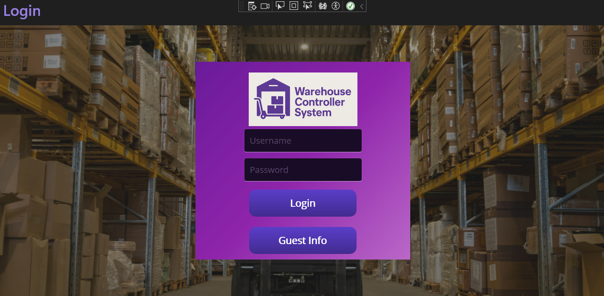
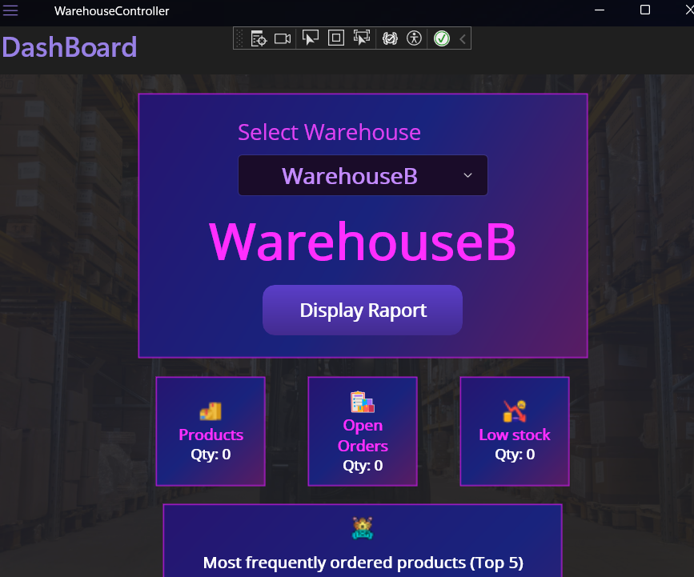

# 🏪 WarehouseController

**WarehouseController** is a cross-platform warehouse management system with:

- 🔐 Secure user authentication (JWT)  
- 📦 Full inventory and order tracking  
- 📊 Real-time dashboard and reports  
- 📱 MAUI client (🟣 .NET 9) & 🌐 ASP.NET Core WebAPI backend (🟦 .NET 8)

---

## 🔧 Tech Stack

| Layer      | Technology                       |
|------------|----------------------------------|
| Frontend   | .NET MAUI (.NET 9)               |
| Backend    | ASP.NET Core Web API (.NET 8)    |
| Database   | SQL Server (EF Core 8)           |
| Auth       | JWT Bearer Tokens                |
| Charts     | Microcharts + SkiaSharp (MAUI)   |
| Docs       | Swagger / Swashbuckle            |

---

## 📁 Project Structure

```
WarehouseController/
├── API/ # ASP.NET Core backend
│   ├── Controllers/
│   ├── DTO/
│   ├── Models/
│   └── Program.cs
│
├── MAUIClient/ # .NET MAUI Frontend
│   ├── View/
│   ├── ViewModel/
│   ├── Services/
│   ├── Converters/
│   ├── DTO/
│   ├── Model/
│   ├── Resources/
│   ├── App.xml
│   ├── AppShell.xml
│   └── MauiProgram.cs
```

---

## 📦 Prerequisites

- ✅ .NET 8 SDK for API  
- ✅ .NET 9 SDK for MAUI client  
- ✅ Visual Studio 2022+ with MAUI workload  
- ✅ SQL Server

---

## 🚀 Frontend (MAUI)

- Initial screen: LoginPage  
- After login → navigates to Dashboard  
- Flyout menu with links to manage entities  
- Supports Android, Windows, iOS

---

## 🔐 Authentication Flow (JWT)

- User logs in via `/api/User/login`  
- Receives `access_token` (JWT)  
- Token is stored in the MAUI app and attached to HTTP headers:

```
Authorization: Bearer {token}
```

---

## 📦 Backend API Features

- 🔒 POST `/api/User/login` – authenticate user  
- 📦 GET `/api/Product`  
- 🏢 GET `/api/Warehouse`  
- 🧾 GET `/api/Order`  
- 🚚 GET `/api/Shipment`  
- 📊 GET `/api/Supplier`  
- 🧍 GET `/api/User`  
- 📦 GET `/api/Category`  

➡️ Full API docs available in Swagger UI.

---

## 📱 MAUI Client Features

- ✅ Functional Screens  
  - 🔐 Login  
  - 🏠 Dashboard (welcome + summary + charts)  
  - 📦 Product List (CRUD)  
  - 🧾 Order Management (Create/Edit/View)  
  - 🚚 Shipment tracking  
  - 👨‍💼 Supplier and User Management  
  - 📊 Top 5 Product Bar Chart  

---

## 📊 Dashboard Widgets

- **Products** – Total quantity in selected warehouse  
- **Open Orders** – Number of active orders  
- **Low Stock** – Items below stock threshold  
- **Top Products** – Bar chart of top 5 most ordered items  
- **Last Orders** – 5 most recent orders  
- **Last Shipments** – 5 most recent deliveries  

---

## 🔐 Sample login JSON

```json
{
  "login": "admin",
  "password": "strongpassword"
}
```

---

## 🖼️ Screenshots

### 🔐 Login View  



### 📊 Dashboard View  


---

## 🧑‍💻 Author

📧 kamilawichowska@hotmail.com  
🌐 [github.com/Kamci](https://github.com/Kamci)

---

## 🪪 License

MIT License
